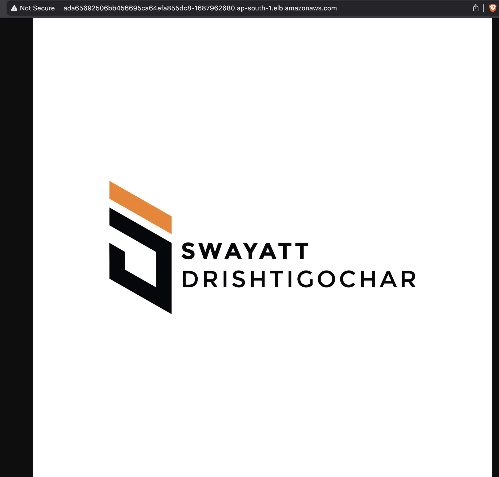

# DevOps Task – CI/CD Pipeline with Jenkins, AWS ECR & EKS

## Objective
The objective of this project is to **set up a CI/CD pipeline** for a sample Node.js application using **AWS, Jenkins, Docker, and Kubernetes (EKS)**.  
The pipeline demonstrates **automation, scalability, and DevOps best practices**.

---

## 📂 Repository Structure
```bash
.
├── app.js                  # Sample Node.js application
├── package.json            # Node.js dependencies
├── Dockerfile              # Containerization file
├── Jenkinsfile             # Jenkins CI/CD pipeline
├── k8s/                    # Kubernetes manifests
│   ├── deployment.yaml
│   └── service.yaml
├── deployment-proof/       # Deployment screenshots & proof
│   ├── eks
│   ├── deployment
│   └── AWS(services)
├── README.md               # Documentation

```
```bash

## 🛠 Tools & Services Used
- **GitHub** → Source code management  
- **Jenkins** → CI/CD automation (webhook-triggered pipeline)  
- **Docker** → Containerization of Node.js app  
- **AWS ECR** → Private container registry  
- **AWS EKS (Kubernetes)** → Orchestrating application deployment  
- **CloudWatch** → Basic monitoring & logging  
- **Terraform** → Infrastructure as Code  
```
  [https://github.com/Kunal2703/myproject-terraform.git](https://github.com/Kunal2703/myproject-terraform.git)


## 📸 Deployment Proof
- ✅ Jenkins pipeline executed successfully  
- ✅ Application deployed to **AWS EKS**  
- ✅ Accessible via AWS Load Balancer  


```

```bash
🔗 **Public URL:**  
```
[http://ada65692506bb456695ca64efa855dc8-1687962680.ap-south-1.elb.amazonaws.com/](http://ada65692506bb456695ca64efa855dc8-1687962680.ap-south-1.elb.amazonaws.com/)


```bash
🔗 **Output:**  
```
